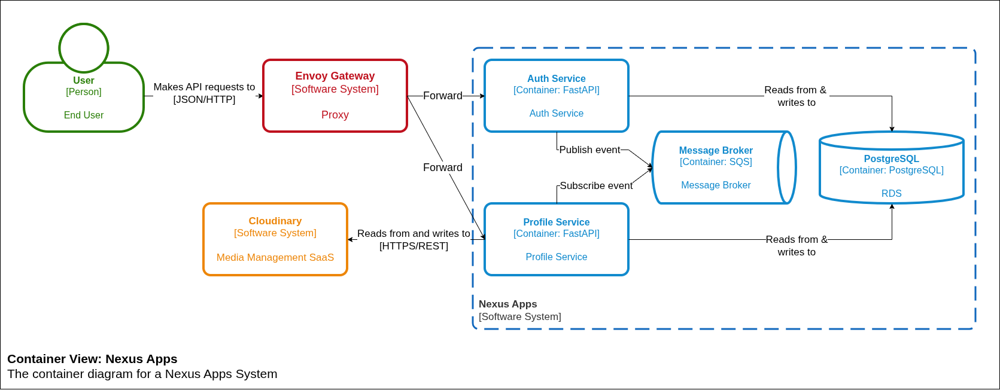
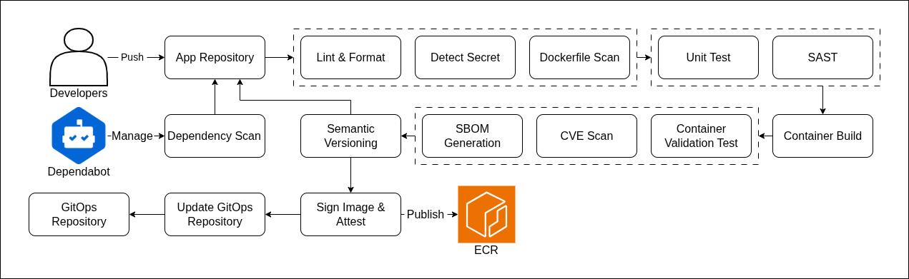

<div align="center">
  
  <h3>A Microservices-Based User and Profile Management System</h3>
</div>

## About

A user and profile management system that provides registration, authentication,
identity lookup and profile management. The application uses a microservices
architecture, event-driven communication and an automated CI/CD pipeline with
quality, security, reliability and policy checks.

## Architecture


<i>Architecture Diagram - C4 Model (Container View)</i>
<br>

### Components

| Component | Type | Responsibility |
| --- | --- | --- |
| Auth | Service | User registration, login, logout, and identity lookup |
| Profile | Service | Profile retrieval, profile updates, and avatar uploads |
| Amazon SQS | Message broker | Asynchronous delivery of events |
| PostgreSQL | Relational database | Persistent storage for user and profile data |

### Directory Structure

```text
services/
  auth-service/       Authentication service
  profile-service/    Profile service
docs/
  architecture/       Application container view
  openapi/            Versioned API specifications
  api.md              Public and operational API summary
.github/workflows/    CI/CD workflows
```

Each service has its own information like pyproject, uv environment, changelog, semantic version and image release. A change to one service does not force a release of the other service.

## Tech Stack

- Python 3.14
- FastAPI
- Pydantic and Pydantic Settings
- Psycopg 3 and PostgreSQL
- Boto3 and Amazon SQS
- Cloudinary
- uv
- Ruff and pytest
- Docker

## CI/CD


<i>CI/CD Pipelines</i>
<br>
<br>

| Stage | Purpose | Tooling |
| --- | --- | --- |
| Lint and Format | Enforce consistent Python style and formatting | Ruff |
| Secret Detection | Detect credentials and secrets committed to source control | Gitleaks |
| Dockerfile Linting | Validate Dockerfile syntax and best practices | Hadolint |
| SAST | Analyze source code for security vulnerabilities | CodeQL |
| Container Build | Build service images for changed services | Docker |
| Container Validation | Start each image and verify its health endpoint | curl |
| CVE Scan | Scan the generated SBOM for fixable vulnerabilities | Anchore and Grype |
| SBOM Generation | Generate an SPDX software bill of materials | Syft |
| Semantic Versioning | Version and release each changed service independently | Semantic Release |
| Image Signing and Attestation | Sign image digests and attest their SBOMs | Cosign |
| GitOps Update | Open a deployment image update in the GitOps repository | GitHub Bot |

## Contributing

Contributions are welcome. Submit changes through a PR and ensure the
relevant lint, test, and security checks pass. This project follows the
[Conventional Commits](https://www.conventionalcommits.org/) specification.
Commit messages must use the format `type(scope): description`.
