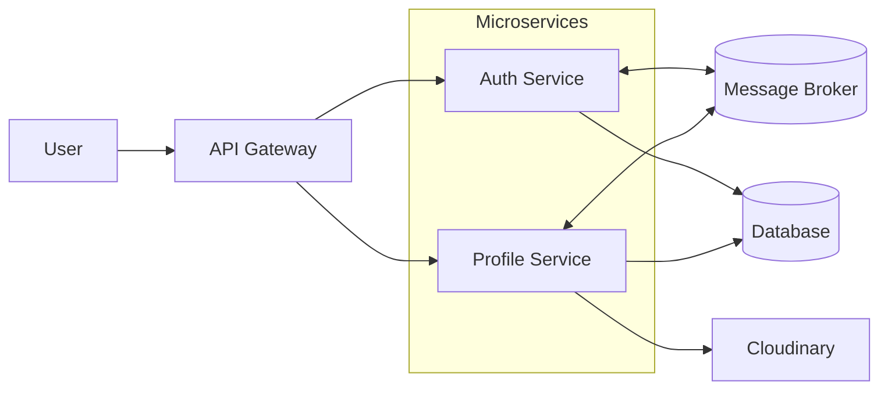

# Nexus Application Architecture

## Overview

Nexus contains two microservices:

- `auth-service` owns registration, authentication, access tokens, and user identity.
- `profile-service` owns user profile data and avatar uploads.

## Container View

## Components

| Component | Responsibility |
| --- | --- |
| User | Calls the public application API |
| API Gateway | Routes requests to the responsible service |
| Auth Service | Registration, login, logout, token issuance, and user events |
| Profile Service | Profile reads, profile updates, and avatar uploads |
| Message Broker | Asynchronous communication between services |
| Database | Stores user and profile data |
| Cloudinary | Stores and delivers avatar images |

## Main Flows

### API Request

1. The user sends a request to the API Gateway.
2. The gateway routes the request to Auth Service or Profile Service.
3. The selected service processes the request and accesses the database when required.

### User Registration

1. Auth Service creates the user and publishes a registration event to the broker.
2. Profile Service consumes the event and creates the corresponding profile.

### Avatar Upload

1. The user sends an authenticated avatar request through the API Gateway.
2. Profile Service uploads the image to Cloudinary.
3. Profile Service stores the returned avatar URL in the database.
